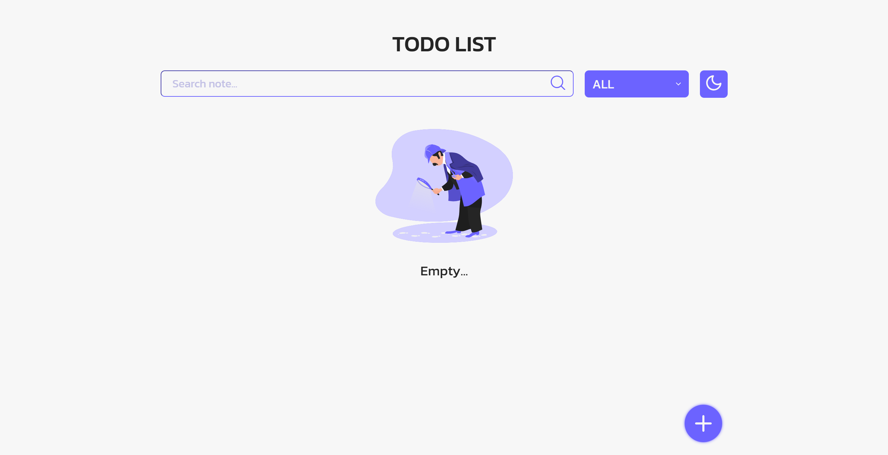
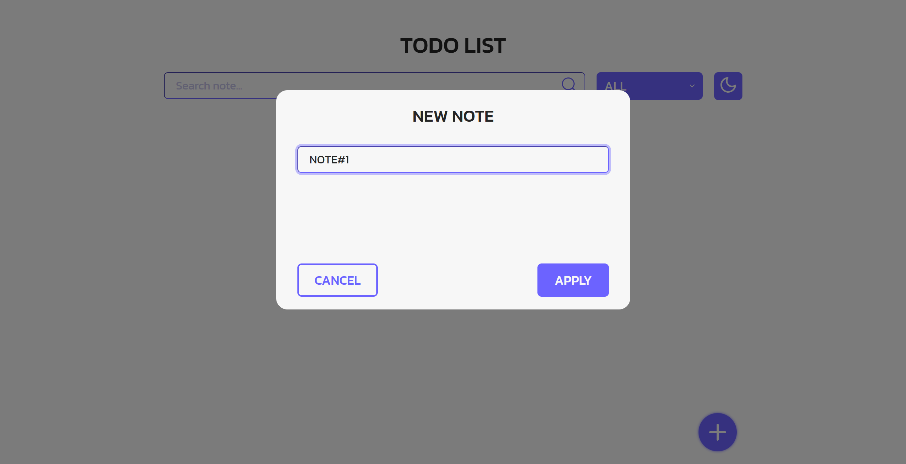
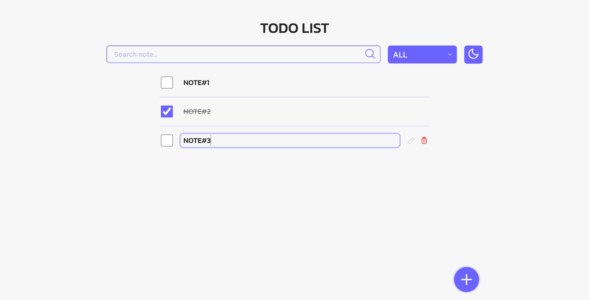
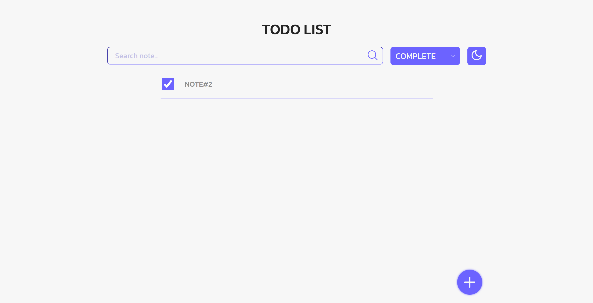
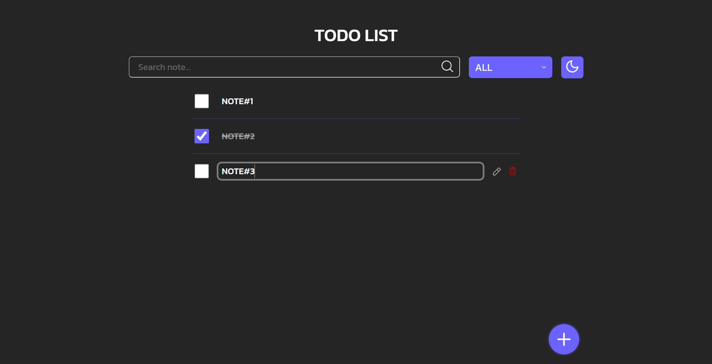

# 🎓 Лабораторная работа №4: Проект Тудулиста (sass + tailwind)


## 📸 Скриншоты











## 🛠️ Технологии

- **Frontend**: HTML5, CSS3, JavaScript, SASS
- **Архитектура**:
```
scss-jquery/
├─ asets/
│ ├─ fonts/
│ ├─ svg/
├─ dist/
│ ├─ css/
├─ js
├─ scss/
│ ├─ base/ 
│ ├─ components/ 
│ ├─ layout/
│ ├─ utils/
│ └─ main.scss
├─ index.html
├─ README.md
└─ .gitignore
```

## Чек лист

✔️**Базовая структура To-Do: список задач + форма/модалка для добавления** <br/>
Референс: [бэмс](https://www.figma.com/design/LO7ahCcd7UVFqpq8mx22DP/Simple-ToDo-List-Design--Community-?node-id=0-1&t=NEjVnZJRKItifGID-1)

---
✔️**Карточка задачи содержит: чекбокс, название, кнопки редактирования и удаления** <br/>

---
✔️**Добавление задачи через модальное окно с формой** <br/>

---
✔️**Редактирование задачи — меняется название** <br/>

---
✔️**Удаление задачи работает** <br/>

---
✔️**Переключение темы (светлая/тёмная)** <br/>

---
✔️**Поиск по названию задачи (динамическая фильтрация списка)** <br/>

---
✔️**Использование Sass/Scss для стилей (структурировано)** <br/>

---
✔️**Код написан на Vanilla JS или jQuery (по выбору)** <br/>

---
✔️**Присутствует адаптивность (мобильный / десктоп)** <br/>

---
✔️**Работает отметка о выполнении задачи** <br/>

---

## Установка / Запуск

1. Клонируйте репозиторий:
```
git clone https://github.com/WonderSi/webdev-frontend-todolist.git
```
2. Переключитесь на ветку `scss-jquery`:
```
git checkout scss-jquery
```
3. Откройте файл `index.html` в браузере:

---
Выполнил Козлов Кирилл ФИТ-231


